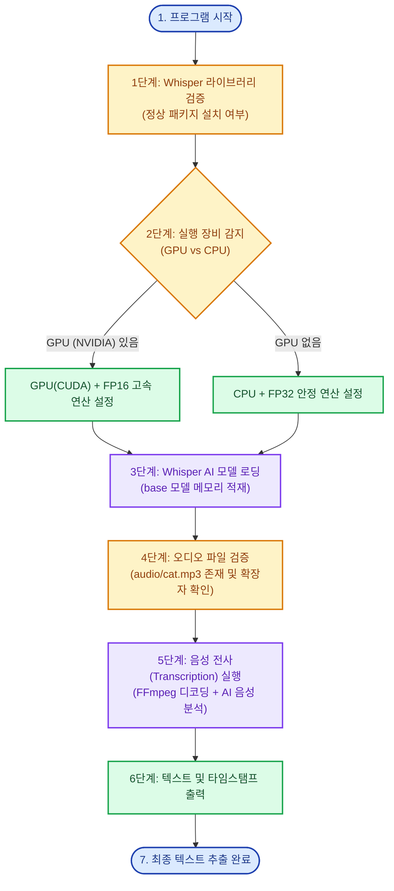
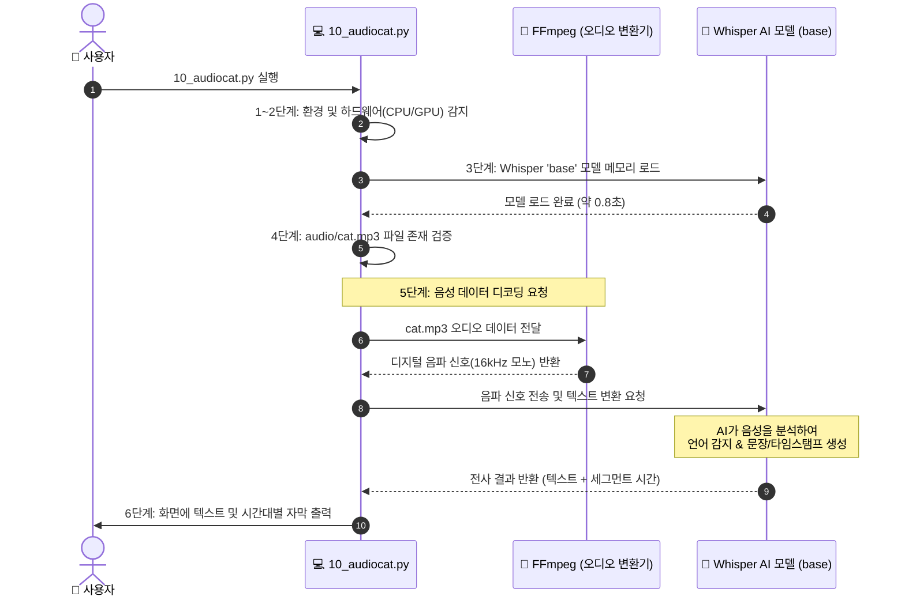

# <span style="color: #1E3A8A;">🎙️ 초보자를 위한 `10_audiocat.py` (Whisper 음성 인식) 완벽 가이드</span>

> [!NOTE]
> 이 문서는 OpenAI의 오픈소스 음성 인식 AI 모델인 **Whisper(위스퍼)**를 활용하여 오디오 파일(`.mp3`, `.wav` 등)에서 사람의 목소리를 텍스트로 추출하는 원리를 초보자 눈높이에 맞춰 설명한 가이드입니다.

---

## <span style="color: #2563EB;">1. 🌟 전체 동작 흐름도 (Mermaid)</span>

### <span style="color: #0284C7;">📊 플로우차트 (6단계 파이프라인)</span>



---

### <span style="color: #0284C7;">🔄 시퀀스 다이어그램 (순서도)</span>



---

## <span style="color: #059669;">2. 💡 현실 세계 비유로 이해하기</span>

이 코드는 **<span style="color: #059669;">외국어와 모든 소리를 들을 수 있는 "속기사(AI)"</span>**에게 녹음테이프를 들려주고 받아쓰기를 시키는 과정입니다.

| 코드 속 구성 요소 | 현실 세계 비유 | 설명 |
| :--- | :--- | :--- |
| **`audio/cat.mp3`** | 📼 **녹음 테이프** | 텍스트로 바꾸고 싶은 목소리가 담긴 오디오 파일 |
| **`FFmpeg`** | 📻 **카세트 플레이어** | 테이프(MP3)를 AI가 들을 수 있는 소리 신호로 재생해 주는 기계 |
| **`Whisper (base)`** | 🧑‍💼 **전문 속기사 (AI)** | 소리를 듣고 무슨 말인지 한국어, 영어, 일본어 등으로 받아 적는 두뇌 |
| **`GPU / CPU`** | ⚡ **속기사의 작업 속도** | GPU가 있으면 10배 빠르게 받아 적고, CPU는 차근차근 적음 |
| **`Segments`** | ⏱️ **자막 타임코드** | 몇 초부터 몇 초까지 무슨 말을 했는지 찍어주는 시간표 |

---

## <span style="color: #7C3AED;">3. 🧩 코드 6단계 핵심 분해</span>

### <span style="color: #6D28D9;">1단계: 패키지 유효성 검사 (`validate_whisper`)</span>
- **역할**: 파이썬에 동명의 엉뚱한 `whisper` 라이브러리가 깔렸거나 파일명이 `whisper.py`로 겹쳐서 발생하는 충돌을 사전에 방지합니다.

---

### <span style="color: #6D28D9;">2단계: 장치 자동 감지 (`detect_device`)</span>
- **역할**: 내 컴퓨터에 NVIDIA 그래픽카드(CUDA)가 있는지 확인합니다.
  - **GPU 탑재 시**: `device='cuda'`, `fp16=True` (초고속 연산)
  - **CPU만 있을 시**: `device='cpu'`, `fp16=False` (경고 없는 안정 연산)

---

### <span style="color: #6D28D9;">3단계: 모델 로딩 (`load_whisper_model`)</span>
```python
model = whisper_module.load_model("base", device=device)
```
- **역할**: Whisper 모델(`base`)을 메모리에 적재합니다. (최초 1회 실행 시 자동으로 인터넷에서 모델 가중치 파일 약 140MB를 다운로드합니다.)

---

### <span style="color: #6D28D9;">4단계: 오디오 파일 검증 (`validate_audio`)</span>
- **역할**: `audio/cat.mp3` 파일이 실제 존재하는지, 지원되는 확장자(`.mp3`, `.wav`, `.m4a` 등)인지 검사합니다.

---

### <span style="color: #6D28D9;">5단계: 음성 전사(Transcription) (`transcribe_audio`)</span>
```python
result = model.transcribe(audio_path, fp16=use_fp16)
```
- **역할**: AI가 음성 파일을 듣고 텍스트로 변환합니다. 언어(`language`)를 지정하지 않으면 AI가 스스로 언어를 자동 감지합니다.

---

### <span style="color: #6D28D9;">6단계: 결과 및 타임스탬프 출력 (`print_result`)</span>
- **역할**: 전체 변환 문장과 함께 영상 자막(SRT/VTT)처럼 구간별 시작/종료 시간을 깔끔하게 표기합니다.
  ```text
  [  0.00s →   3.00s]  Show me the cat information
  ```

---

## <span style="color: #D97706;">4. 📊 Whisper 모델 크기 종류</span>

상황에 따라 `MODEL_SIZE`를 변경하여 사용할 수 있습니다:

| 모델 크기 | 파일 용량 | 필요 VRAM/RAM | 속도 | 정확도 | 용도 |
| :--- | :--- | :--- | :--- | :--- | :--- |
| **`tiny`** | ~75 MB | ~1 GB | 🚀 가장 빠름 | 보통 | 실시간 간단한 음성 |
| **`base` (기본값)** | ~145 MB | ~1 GB | ⚡ 빠름 | 좋음 | 일반적인 한국어/영어 테스트 |
| **`small`** | ~480 MB | ~2 GB | ⏱️ 보통 | 높음 | 일상 대화 녹음 |
| **`medium`** | ~1.5 GB | ~5 GB | 🐢 느림 | 매우 높음 | 강의, 회의록 녹취 |
| **`large`** | ~3.0 GB | ~10 GB | 🦥 매우 느림 | 최고 수준 | 전문 방송, 전문 용어 |

---

## <span style="color: #DC2626;">5. ⚠️ 필수 선행 요구사항 (자주 발생하는 문제)</span>

> [!IMPORTANT]
> 1. **FFmpeg 필수**: Whisper는 오디오 파일을 읽기 위해 시스템에 `FFmpeg` 프로그램이 설치되어 있어야 합니다. (현재 PC에는 `ffmpeg 9.0.1` 설치 완료)
> 2. **올바른 패키지 설치**: 
>    ```bash
>    pip uninstall whisper -y
>    pip install openai-whisper torch
>    ```
