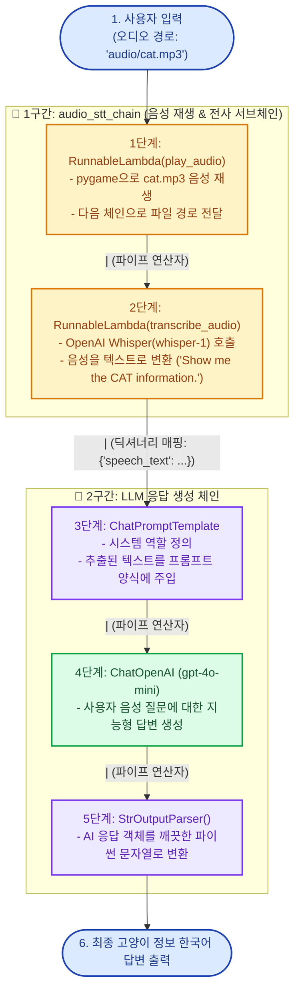
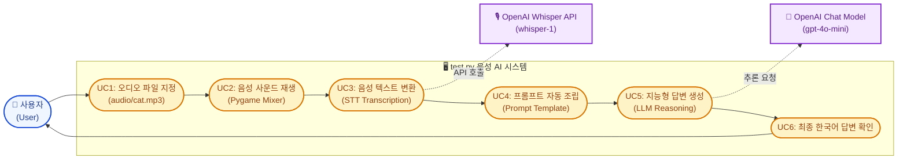

```mermaid
gantt
    title ⏱️ test.py LCEL 파이프라인 실행 시간표 (Gantt Chart)
    dateFormat X
    axisFormat %s초
    
    section 1. 파일 검증
      오디오 경로 확인 (cat.mp3)        :done, f1, 0, 300
    
    section 2. 오디오 서브체인
      스피커 사운드 재생 (Pygame)      :active, a1, 300, 3100
      음성인식 전사 (OpenAI Whisper)   :crit, active, a2, 3100, 4800
    
    section 3. LLM AI 체인
      프롬프트 템플릿 변수 바인딩      :done, l1, 4800, 5000
      GPT-4o-mini 답변 추론 및 생성    :crit, active, l2, 5000, 7200
      StrOutputParser 문자열 추출      :done, l3, 7200, 7400
    
    section 4. 결과 출력
      최종 한국어 가이드 터미널 출력   :done, o1, 7400, 7600
```

# <span style="font-size: 2.2em; font-weight: 800; color: #1E3A8A; line-height: 1.3;">🎙️ 초보자를 위한 `test.py` (LangChain LCEL 음성인식 파이프라인) 완벽 가이드</span>

> [!NOTE]
> 이 문서는 **LangChain의 핵심 기술인 LCEL(LangChain Expression Language)**과 **OpenAI Whisper(음성인식)** 모델을 결합하여, 오디오 파일(`cat.mp3`)을 재생하고 텍스트로 변환(STT)한 뒤 AI 답변까지 생성하는 과정을 초보자 눈높이에 맞춰 설명한 가이드입니다.

---

## <span style="font-size: 1.6em; font-weight: 700; color: #2563EB;">1. 🌟 전체 동작 구조도 (Mermaid)</span>

### <span style="font-size: 1.3em; font-weight: 600; color: #0284C7;">📊 1. 플로우차트 (LCEL 파이프라인 데이터 흐름도)</span>



---

### <span style="font-size: 1.3em; font-weight: 600; color: #0284C7;">🎯 2. 유스케이스 다이어그램 (Use Case Diagram)</span>



---

### <span style="font-size: 1.3em; font-weight: 600; color: #0284C7;">⏱️ 3. 간트 차트 (Gantt Chart: 실행 타임라인)</span>



---

## <span style="font-size: 1.6em; font-weight: 700; color: #059669;">2. 💡 현실 세계 비유로 이해하기</span>

이 코드는 **<span style="color: #059669;">"스피커"</span>**와 **<span style="color: #2563EB;">"귀(청각)"</span>**와 **<span style="color: #7C3AED;">"두뇌(지능)"</span>**가 파이프라인(`|`)으로 연결된 **스마트 AI 비서**입니다.

| 코드 속 구성 요소 | 현실 세계 비유 | 설명 |
| :--- | :--- | :--- |
| **`cat.mp3`** | 📼 **음성 녹음 테이프** | "고양이 정보 알려줘"라고 말한 목소리가 담긴 파일 |
| **`play_audio`** | 📢 **카세트 플레이어** | 테이프를 사용자 귀에 들리도록 스피커로 틀어줌 |
| **`transcribe_audio`** | 👂 **귀 & 속기사 (Whisper)** | 소리를 듣고 "Show me the CAT information."이라고 글자로 받아 적음 |
| **`|` (파이프 연산자)** | 🏭 **컨베이어 벨트 (LCEL)** | 앞 단계의 결과물을 다음 단계로 멈춤 없이 척척 넘겨주는 연결선 |
| **`ChatPromptTemplate`** | 📋 **업무 보고 양식** | 받아 적은 글자를 AI가 이해하기 좋은 질문 양식으로 정리 |
| **`ChatOpenAI (GPT-4o-mini)`** | 🧠 **똑똑한 박사님 (두뇌)** | 고양이에 대한 전문 지식을 알기 쉽게 설명해 줌 |
| **`StrOutputParser`** | 📄 **최종 인쇄기** | AI의 복잡한 응답 데이터에서 글자(Text)만 쏙 뽑아 출력 |

---

## <span style="font-size: 1.6em; font-weight: 700; color: #7C3AED;">3. 🧩 코드 4단계 핵심 분해</span>

### <span style="font-size: 1.3em; font-weight: 600; color: #6D28D9;">1단계: 일반 함수를 LCEL 부품으로 만들기 (`RunnableLambda`)</span>
```python
def play_audio(audio_path: str) -> str:
    # pygame을 통해 MP3 소리를 재생하고, 경로를 그대로 반환합니다.
    ...
    return audio_path

def transcribe_audio(audio_path: str) -> str:
    # Whisper API를 호출하여 음성을 텍스트로 변환합니다.
    ...
    return transcribed_text
```
> [!TIP]
> **왜 `RunnableLambda`를 쓸까요?**  
> 파이썬의 일반 함수(`def`)는 LangChain의 `|` (파이프) 기호로 직접 연결할 수 없습니다.  
> `RunnableLambda(함수명)`으로 감싸주면 LangChain이 인식할 수 있는 **레고 블록(Runnable 컴포넌트)**이 됩니다.

---

### <span style="font-size: 1.3em; font-weight: 600; color: #6D28D9;">2단계: 서브 파이프라인 조립 (`audio_stt_chain`)</span>
```python
audio_stt_chain = (
    RunnableLambda(play_audio)
    | RunnableLambda(transcribe_audio)
)
```
- **입력**: `"audio/cat.mp3"` (파일 경로 문자열)
- **동작**: 소리를 재생하고(`play_audio`) ➔ 텍스트로 변환(`transcribe_audio`)
- **출력**: `"Show me the CAT information."` (전사된 텍스트)

---

### <span style="font-size: 1.3em; font-weight: 600; color: #6D28D9;">3단계: 프롬프트와 LLM 모델 준비</span>
```python
prompt = ChatPromptTemplate.from_messages([
    ("system", "당신은 사용자의 음성 명령을 빠르고 정확하게 처리하는 친절한 AI 어시스턴트입니다."),
    ("user", "사용자의 음성 입력 내용: \"{speech_text}\"\n\n위 음성 명령/질문에 대해 상세하고 유익한 답변을 작성해주세요.")
])

model = ChatOpenAI(model="gpt-4o-mini", temperature=0.7)
```
- `{speech_text}` 변수 자리에 앞 단계에서 전사된 텍스트가 자동으로 들어갑니다.

---

### <span style="font-size: 1.3em; font-weight: 600; color: #6D28D9;">4단계: 전체 체인 완성 및 실행 (`full_chain`)</span>
```python
# 전체 체인 결합
full_chain = (
    {"speech_text": audio_stt_chain}
    | prompt
    | model
    | StrOutputParser()
)

# 단 한 줄로 전체 과정 실행!
ai_response = full_chain.invoke("audio/cat.mp3")
```
- `{"speech_text": audio_stt_chain}`: 입력된 오디오 경로를 서브체인에 통과시켜 텍스트를 얻은 후, 프롬프트의 `{speech_text}` 키에 매핑합니다.
- `| prompt | model | StrOutputParser()`: 프롬프트 완성 ➔ GPT-4o-mini 호출 ➔ 텍스트 추출까지 일사천리로 동작합니다.

---

## <span style="font-size: 1.6em; font-weight: 700; color: #D97706;">4. 🔍 LCEL (LangChain Expression Language)의 3대 장점</span>

> [!IMPORTANT]
> 1. **가독성과 직관성**: 코드의 흐름이 `A | B | C | D` 형태로 한눈에 보여서 데이터가 어떻게 이동하는지 쉽게 파악할 수 있습니다.
> 2. **유지보수와 재사용성**: 서브 체인(`audio_stt_chain`)을 독립적으로 테스트하거나 다른 체인에 손쉽게 끼워 넣을 수 있습니다.
> 3. **비동기/스트리밍/배치 지원**: LCEL로 작성된 체인은 코드 수정 없이 `.invoke()`, `.stream()`, `.batch()`, `.ainvoke()` 등을 즉시 사용할 수 있습니다.
