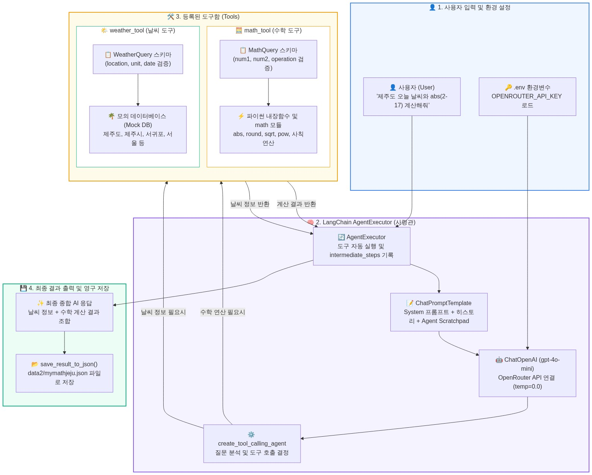
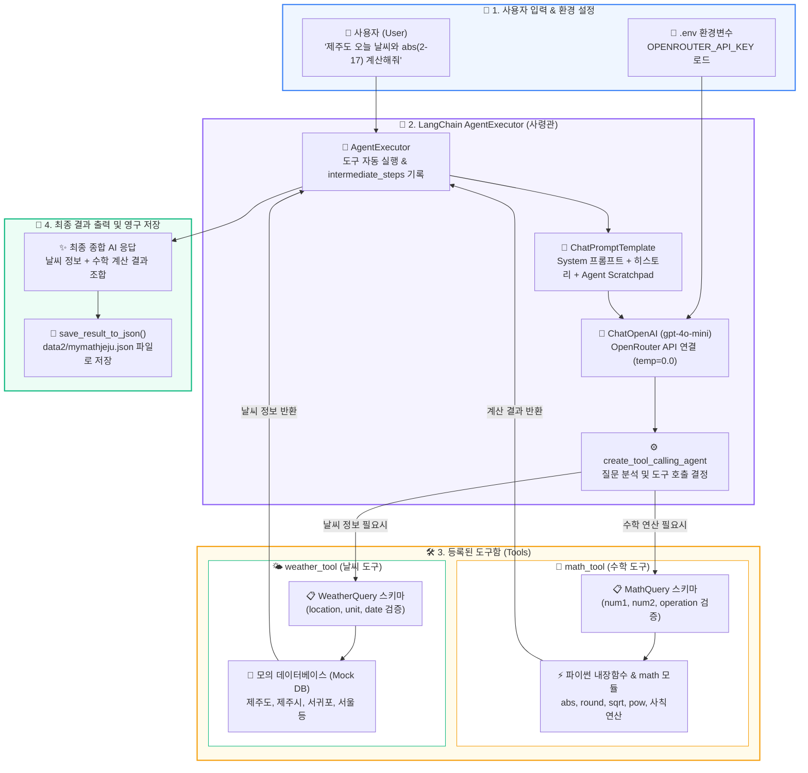
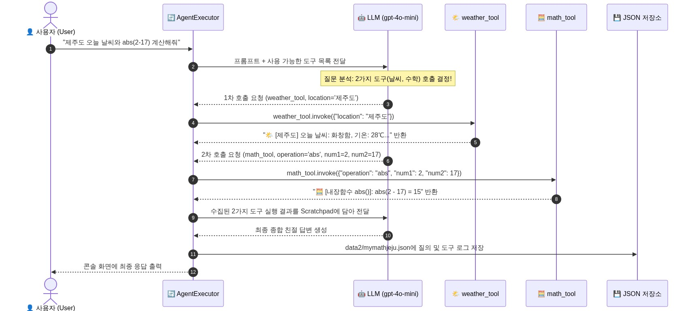
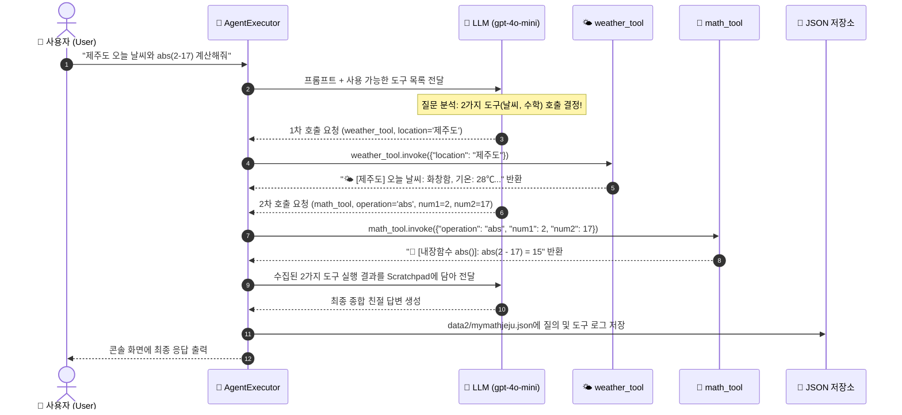
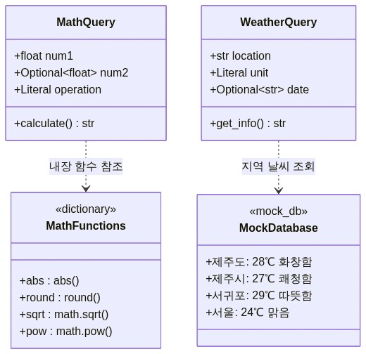
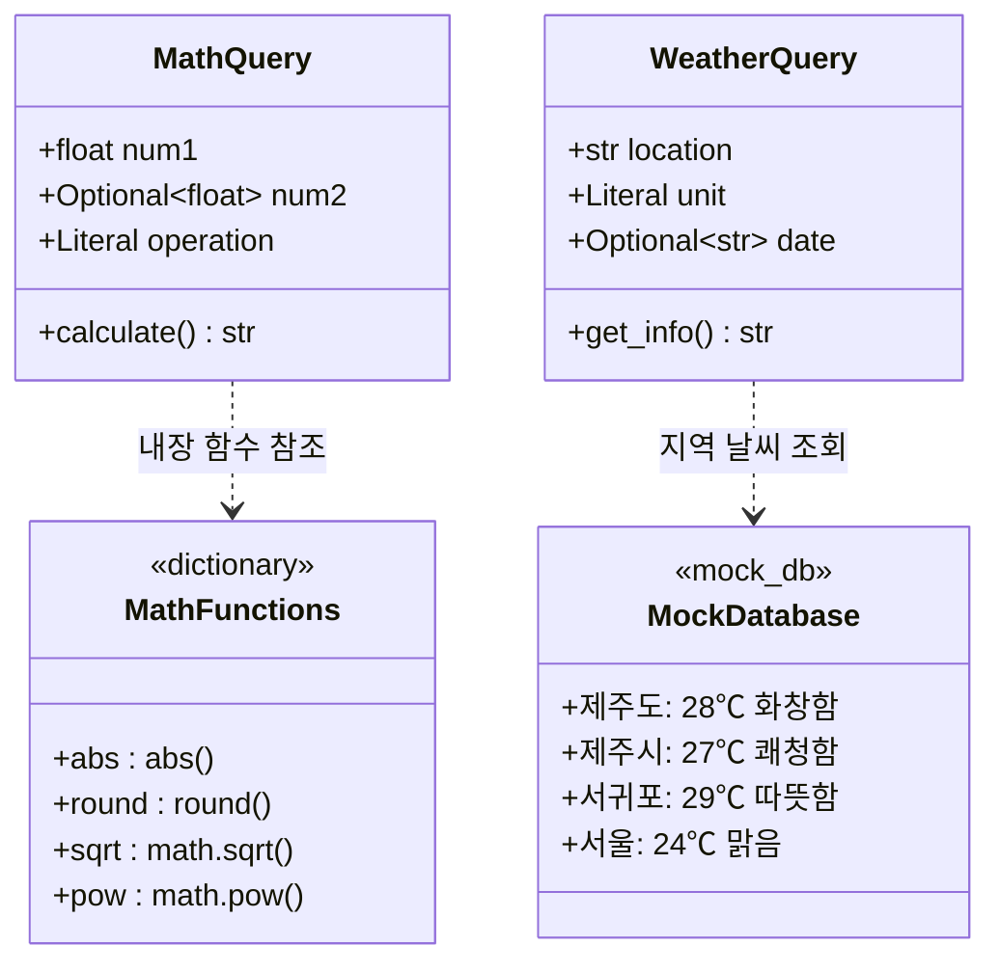

<div style="background: linear-gradient(135deg, #1e3a8a 0%, #3b82f6 50%, #06b6d4 100%); padding: 36px 28px; border-radius: 16px; color: white; text-align: center; margin-bottom: 30px; box-shadow: 0 8px 24px rgba(0,0,0,0.15);">
  <span style="background: rgba(255,255,255,0.25); color: #ffffff; padding: 6px 14px; border-radius: 20px; font-size: 0.85rem; font-weight: 700; letter-spacing: 1px; text-transform: uppercase;">LangChain Agent Architecture</span>
  <h1 style="font-size: 2.4rem; color: #fef08a; margin: 12px 0 8px 0; font-weight: 800; letter-spacing: -0.5px; line-height: 1.2;">
    🍊 MyMathJeju.py 핵심 구조도 & 초보자 가이드
  </h1>
  <p style="font-size: 1.15rem; color: #f1f5f9; margin: 0; font-weight: 500;">
    초보자를 위한 LangChain <span style="color: #67e8f9; font-weight: 700;">AgentExecutor</span> 도구 호출(Tool Calling) 및 파이프라인 완벽 해설
  </p>
</div>

---

<h2 style="color: #1e40af; border-left: 6px solid #3b82f6; padding-left: 12px; font-size: 1.55rem; margin-top: 30px; margin-bottom: 16px;">
  💡 1. 한눈에 보는 전체 시스템 구조도 (System Architecture)
</h2>

`mymathjeju.py`는 사용자의 질문을 받아서 **두뇌 역할의 AI(LLM)**가 상황을 판단하고, **수학 계산 도구**와 **제주 날씨 도구**를 스스로 골라 실행한 뒤 결과를 종합하여 답변하고 **JSON 파일로 저장**하는 지능형 에이전트 프로그램입니다.

<p align="center">
  
</p>

<details>
<summary><b>🔍 Mermaid 코드 펼쳐보기</b></summary>


</details>

---

<h2 style="color: #1e40af; border-left: 6px solid #3b82f6; padding-left: 12px; font-size: 1.55rem; margin-top: 30px; margin-bottom: 16px;">
  🔄 2. 실행 흐름 시퀀스 다이어그램 (Execution Flow)
</h2>

사용자가 복합 질문(날씨 + 수학)을 입력했을 때 내부에서 일어나는 통신 순서입니다.

<p align="center">
  
</p>

<details>
<summary><b>🔍 Mermaid 코드 펼쳐보기</b></summary>


</details>

---

<h2 style="color: #1e40af; border-left: 6px solid #3b82f6; padding-left: 12px; font-size: 1.55rem; margin-top: 30px; margin-bottom: 16px;">
  🧩 3. 초보자를 위한 5가지 핵심 개념 분해
</h2>

<table style="width: 100%; border-collapse: collapse; margin-top: 10px;">
  <thead>
    <tr style="background-color: #1e3a8a; color: white; text-align: left;">
      <th style="padding: 12px 14px; border: 1px solid #cbd5e1; width: 22%;">구성 요소</th>
      <th style="padding: 12px 14px; border: 1px solid #cbd5e1; width: 25%;">초보자 쉬운 비유</th>
      <th style="padding: 12px 14px; border: 1px solid #cbd5e1;">역할 및 코드 설명</th>
    </tr>
  </thead>
  <tbody>
    <tr style="background-color: #f8fafc;">
      <td style="padding: 12px 14px; border: 1px solid #cbd5e1; font-weight: bold; color: #1e40af;">
        1. Pydantic 스키마<br/><code>MathQuery</code>, <code>WeatherQuery</code>
      </td>
      <td style="padding: 12px 14px; border: 1px solid #cbd5e1;">📋 <strong>주문서 양식</strong></td>
      <td style="padding: 12px 14px; border: 1px solid #cbd5e1;">
        도구에 필요한 데이터(숫자, 도시 이름, 연산 종류)의 <strong>형식과 유효성</strong>을 검증합니다. 잘못된 값이 들어오지 못하게 막아줍니다.
      </td>
    </tr>
    <tr>
      <td style="padding: 12px 14px; border: 1px solid #cbd5e1; font-weight: bold; color: #1e40af;">
        2. @tool 데코레이터<br/><code>math_tool</code>, <code>weather_tool</code>
      </td>
      <td style="padding: 12px 14px; border: 1px solid #cbd5e1;">🛠️ <strong>전문 기술자 도구</strong></td>
      <td style="padding: 12px 14px; border: 1px solid #cbd5e1;">
        일반 파이썬 함수를 AI(LLM)가 <strong>이해하고 호출할 수 있는 도구</strong>로 변환합니다. <code>args_schema</code>로 Pydantic 양식을 연결합니다.
      </td>
    </tr>
    <tr style="background-color: #f8fafc;">
      <td style="padding: 12px 14px; border: 1px solid #cbd5e1; font-weight: bold; color: #1e40af;">
        3. 수학 내장함수 매핑<br/><code>MATH_FUNCTIONS</code>
      </td>
      <td style="padding: 12px 14px; border: 1px solid #cbd5e1;">🔢 <strong>공학용 계산기 모듈</strong></td>
      <td style="padding: 12px 14px; border: 1px solid #cbd5e1;">
        파이썬 내장 함수(<code>abs</code>, <code>round</code>)와 <code>math.sqrt</code>, <code>math.pow</code>를 딕셔너리로 매핑하여 안전하고 정확하게 계산합니다.
      </td>
    </tr>
    <tr>
      <td style="padding: 12px 14px; border: 1px solid #cbd5e1; font-weight: bold; color: #1e40af;">
        4. AgentExecutor<br/>(<code>langchain_classic</code>)
      </td>
      <td style="padding: 12px 14px; border: 1px solid #cbd5e1;">👮 <strong>현장 총괄 사령관</strong></td>
      <td style="padding: 12px 14px; border: 1px solid #cbd5e1;">
        AI의 판단에 따라 어떤 도구를 먼저 실행할지 지휘하고, 실행 중간 과정(<code>intermediate_steps</code>)을 기록하며 최종 결론을 도출합니다.
      </td>
    </tr>
    <tr style="background-color: #f8fafc;">
      <td style="padding: 12px 14px; border: 1px solid #cbd5e1; font-weight: bold; color: #1e40af;">
        5. JSON 영구 저장<br/><code>save_result_to_json()</code>
      </td>
      <td style="padding: 12px 14px; border: 1px solid #cbd5e1;">📁 <strong>업무 일지 기록장</strong></td>
      <td style="padding: 12px 14px; border: 1px solid #cbd5e1;">
        질문 내용, AI 최종 답변, 중간 도구 호출 내역(Tool, Args, Result)을 <code>data2/mymathjeju.json</code> 파일에 타임스탬프와 함께 자동 저장합니다.
      </td>
    </tr>
  </tbody>
</table>

---

<h2 style="color: #1e40af; border-left: 6px solid #3b82f6; padding-left: 12px; font-size: 1.55rem; margin-top: 30px; margin-bottom: 16px;">
  📊 4. 도구(Tools) 상세 구조도
</h2>

<p align="center">
  
</p>

<details>
<summary><b>🔍 Mermaid 코드 펼쳐보기</b></summary>


</details>

---

<h2 style="color: #1e40af; border-left: 6px solid #3b82f6; padding-left: 12px; font-size: 1.55rem; margin-top: 30px; margin-bottom: 16px;">
  🚀 5. 실행 방법 및 결과 파일 확인
</h2>

### 1️⃣ 가상환경 활성화 및 실행
```bash
# PowerShell 터미널 기준
.\.venv\Scripts\Activate.ps1

# 프로그램 실행
python mymathjeju.py
```

### 2️⃣ 생성되는 `data2/mymathjeju.json` 구조 예시
```json
{
  "saved_at": "2026-08-27 13:10:00",
  "architecture": "from langchain_classic.agents import AgentExecutor",
  "question": "제주도 오늘 날씨와 abs(2-17) 계산해줘",
  "final_response": "제주도의 오늘 날씨는 28℃로 화창하며, abs(2 - 17)의 절댓값 계산 결과는 15입니다.",
  "tool_logs": [
    {
      "tool": "weather_tool",
      "args": { "location": "제주도" },
      "result": "🌤️ [제주도] 오늘 날씨 정보:\n  - 상태: 화창함 🏖️\n  - 기온: 28℃\n  - 습도: 65%\n  - 풍속: 남서풍 3m/s"
    },
    {
      "tool": "math_tool",
      "args": { "num1": 2, "num2": 17, "operation": "abs" },
      "result": "🧮 [내장함수 abs()]: abs(2.0 - 17.0) = abs(-15.0) = 15.0"
    }
  ]
}
```

---

<div style="background-color: #f1f5f9; border-radius: 10px; padding: 18px; border-left: 5px solid #0284c7; margin-top: 25px;">
  <strong style="color: #0369a1; font-size: 1.05rem;">📌 초보자를 위한 핵심 요약 (Takeaway)</strong>
  <ul style="margin: 8px 0 0 0; padding-left: 20px; color: #334155; line-height: 1.7;">
    <li><strong>LLM 혼자서는 계산이나 실시간 정보에 약합니다:</strong> 그래서 <code>@tool</code>을 이용해 계산기와 날씨 조회 기능을 쥐어줍니다.</li>
    <li><strong>AgentExecutor가 자동으로 판단합니다:</strong> "날씨"와 "계산" 단어를 인식해 두 도구를 알아서 실행하고 결과를 취합합니다.</li>
    <li><strong>모든 실행 기록은 JSON에 저장됩니다:</strong> 디버깅이나 기록 보관용으로 <code>data2/mymathjeju.json</code>에 깔끔하게 남습니다.</li>
  </ul>
</div>
